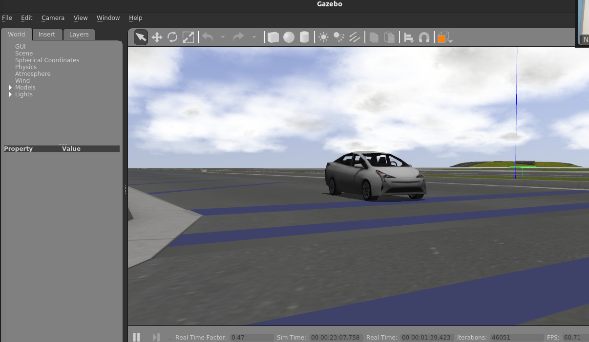
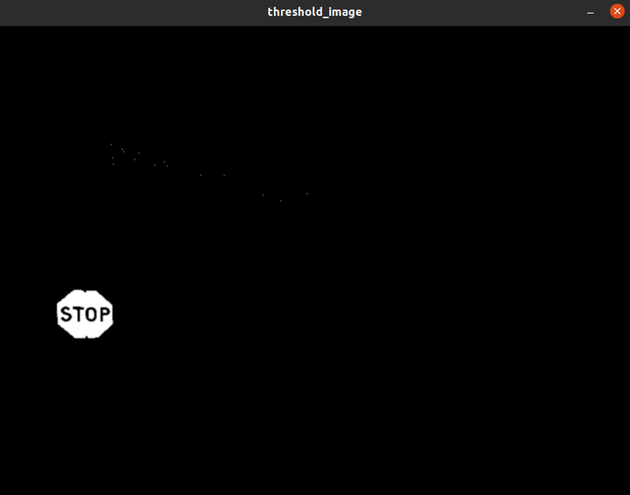
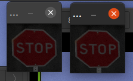

# Writeup

## Goal

The goal of our project was to implement a robot controller capable of responding to street signs in the near vicinity by detecting the sign and passing on that information to a robot, for the robot to react to the sign based on its type. We ran into a couple unforeseen roadbumps along the way, and ended with a final MVP of a project capable of recognizing a stop sign and stopping the motion of a car upon approaching the stop sign at a certain distance.

## Solution Overview
Our solution was implemented as two separate ROS nodes, with one in charge of controlling robot behavior, and one in charge of handling sign detection.
We implemented our code with the OSRF Car Demo Prius Simulator, which granted us a lot of flexibility in how we control our robot and read it's sensor data. The simulation featured a Prius robot model with 40 sensors available (each published to a topic) and the ability to control the Prius via continuous throttle, brake, and steering.

The sign detection rosnode was called on every image from the Prius front camera, and operated using color filtering and feature mapping to detect signs. It published its output as a SignMatch message to the `/sign_matched` topic.

The robot controller node subscribed to the `/sign_matched` topic and altered its behavior based on the presence of detected signs. It's default behavior was to drive forwards in a straight line continuously.  

### Color Filtering

To get a good outline of the red of the stop and yield sign, and the yellow of the road sign, we used color filtering. First we converted the image into HSV (Hue, Saturation, Value) to detect the red and yellow parts of the sign easier than RGB. Red would have a hue between 170 and 10 (hue is a circle from 0 to 179, with 0 and 179 being connected), and yellow a hue centered around 24. Both of them have high saturation values, greater than 150. Since value is light based, the signs can have any number of values, so we ignore value. Utilizing all of these into a threshold, we can create a binary image showing just the sign and some small noise.

Using the contour function, we can find contours of the white in the binary image. From this list of contours, we filter them depending on their area. First, we make sure the area is greater than a threshold. We also check the 'squareness' of the sign, to make sure that the sign is not a odd rectangle. If it passes both of these criteria, we deem it a sign.

### Feature Matching

We wanted to make sure that the stop sign we are getting in subsequent frames is a consistent result, and not just a momentary glitch. To validate this, we perform feature mapping on the bounding boxes of the potential signs.

We store the box of the previous stop sign in a separate variable to compare to the next frame. Since the bounding box is almost exactly around the stop sign, we add an additional border around the sign so that the feature mapper can pick up more key points of the outside of the sign. We use ORB (Oriented FAST and rotated BRIEF) to collect key points and descriptors in each image. We then run those descriptors through the Brute Force Matcher to get a list of which descriptors are matches. Because the resolution and size of the sign has a big effect on the number of key points and matches these methods return. So we can use this both as a validation and a threshold for when the stop sign is in close proximity to the car.

### ROS message

To communicate between the sign detection node and the Prius controller node, we created our own custom ROS message named "SignMatch" that contains an int of the number of matches as well as an int that contains the area of the recognized region in pixels.

### Prius Control

For the Prius control, we start be getting a message from the sign detection node that contains the area of the sign and the number of matches. Based on this, we decide what to do with the Prius. If the number of matches is zero and the area is zero, we haven't seen anything that looks like a sign, so we set the throttle to 0.1 (which is relatively low acceleration that would be used for maintaining velocity). If the number of matches is zero and the area is a low number, we release the throttle and release the brake. This causes the car to coast, like most people would do if the sign is visible in the distance. If the number of matches is zero and the area is a high number, we release the throttle and gently apply the break because it means the sign is close but not close enough to stop completely. If the number of matches is nonzero, that means we are very close to the stop sign, so we brake hard to stop the car.

## Design decision - code-quality focused!
One of the design decisions we faced was on how to structure our code within the `process_frame()` function. We're taking this question from a code quality angle, and are discussing improvements we would have made if given the chance.

The `process_frame()` function was called on every individual frame published to the Prius front camera video topic (within the `main_cam_processor()` function), and needed to meet a few key design constraints in order to perform efficiently. This function should arguably be the center of attention or main jumping point for our computer vision code.  

The function needed to take in the original camera frame and return the exact same frame with bounding regions or boxes overlayed on top. It's interesting to consider our code quality & memory and variable usage within this function - i.e. which variables persist between each frame, which are created and destroyed within the scope of a single frame, and which absolutely need to be global. Which variables would need to be stored on the heap?   

We tried to minimize our usage of global vars wherever we could, only using the global vars `self.previous_regions` and `self.previous_frame` to store previously tracked regions, our color regions, and a single threshold variable. However, we used  `np.copy()` both in the original function call and to generate a display frame. This function is really intensive and could easily be avoided (both times) with just a little code reordering before drawing on images shuffling.

We also store a reference to the previous frame - which is really shitty code.

`self.previous_frame = frame`

We should only store the previous regions of interest (the images themselves) in an array, instead of storing the entire previous frame and an array of rectangle indices.

It might have also made more sense to encapsulate region as a data structure of its own (in a python class) to be used in the rosmsg as well, instead of having a separate SignMatch message and region, in an effort to make the code more readable and clean.

## Challenges

### Feature Matching
Feature matching with classical CV (using ORB and SIFT) is really tough. We spent a lot of time debugging and trying to fine tune our feature matching code only to end up with a feature matcher that couldn't match one image of a stop sign to another image of a sign, given large, clear images with high resolution. Road signs, stop signs in particular, are really, really easy to match with bright color contrasts and obvious corners. This was extremely frustrating, cost us a lot of time, and was ultimately the reason our system performs feature matching between an region of interest from a previous frame and that same region of interest in the current frame.

Even granting the feature matching algorithm the need to only match features between essentially the same image, it still sucks at its job - and only recognizes matches when the image resolution is high.

What does this mean for our final product - our car can't accurately differentiate between a red octogonal bush and a stop sign. The visual features that make a stop sign unique are unrecognizable by our shitty feature matcher implementation.

### Prius Control
The brakes on the prius suck. They need to be held in an active position for a significant period of time before the car begins to slow considerably, let alone stop - which results in a very conservative computer vision algorithm and prevents us from accelerating to any high speeds if we want to be able to reasonably control / stop the car.

In fact, it took us quite a while and a lot of experimenting with the simulator to even characterize the Prius control drive inputs that allowed us to consistently brake and start and stop the car. But these be the woes of experimenting with a new simulator.

## Improvements - what would we change if given a second chance
- making image processing less computationally intensive to reduce lag
  - handle edge cases better and avoid calling intensive functions
- improving the quality of feature matching and detection
  - experiment with alternate feature mapping functions
- spending more time with the simulator to better understand the vehicle dynamics
- add more flexibility & scalability & flesh out sign recognition
  - within sign and region tracking over time - noting how many regions are ID'd, which overlap with each other, etc.
  - within recognizing and publishing data about more than 1 sign in the frame
  - within characterizing estimates at sign distance away from the vehicle
  - within characterizing confidence scores of the signs
  - within adding in the ability to recognize more than red signs
- add more to Prius drive control
  - within writing code to recognize Prius motion from sensor data
  - within enabling more complex reaction procedures that factor in car's motion
  - within prioritizing Prius reaction to multiple signs
  - within enabling a constant speed instead of acceleration for the Prius
- code quality
  - our code features really poor and inconsistent documentation, old unused functions littered all over the place, large sections of commented code that is now meaningless, and really poorly optimized memory and CPU usage. It may appear as if it was written by a drunken middle-schooler who just learned Scratch.

## Interesting lessons learned
- How to create and call a custom ROS message class to simplify data transfer between nodes
  - Certainly will be useful for the future.
- Writing rosnodes from scratch
  - Our implementation was quite simple, it would have been more interesting to implement with the tf module, but this was still good practice within the ROS environment.
- Experimenting with and setting up a complex robot simulation environment for the first time.
  - There were a lot of quirks to the Prius simulator and it was certainly worth it to learn to work with. It's functionality far exceeded our needs for this project, and there is much more we can work on and work with within this simulator in the future.
